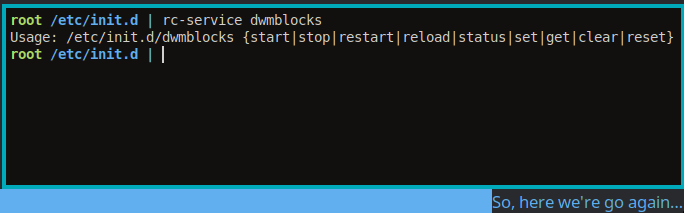

# dwmblocks-rc

**dwmblocks-rc** ist ein minimalistischer, signal- und dateibasierter Controller für [dwmblocks](https://github.com/torrinfail/dwmblocks), speziell für **Devuan** und andere **System-V init Systeme** ohne systemd.
